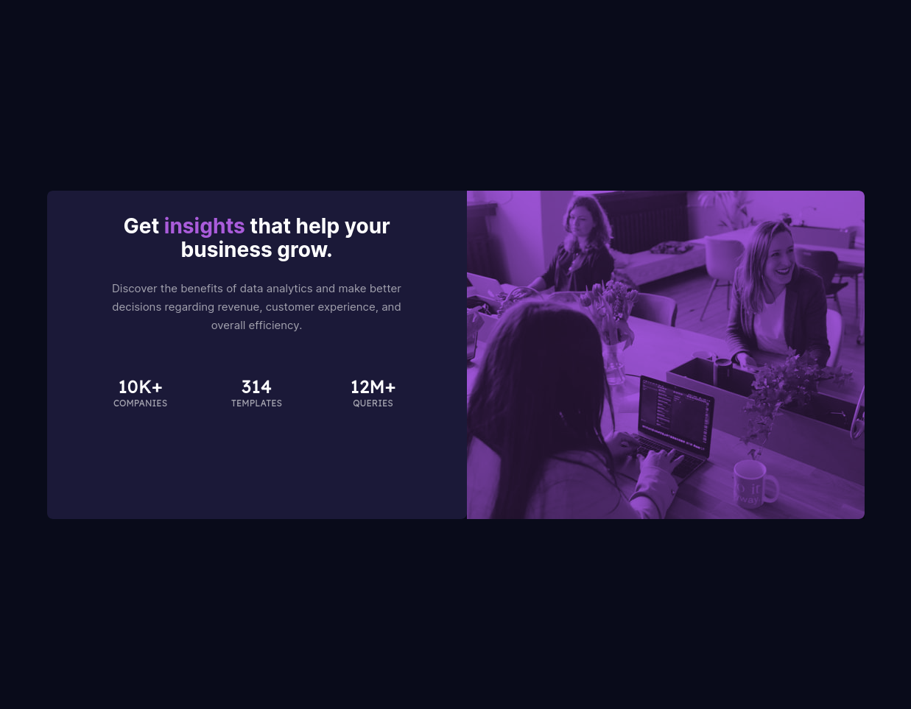

# Frontend Mentor - Stats preview card component solution

### The challenge

I thought this one would be a walk in the park. Boy was I wrong. I had a hell of a time getting the image to:

- Be responsive
- Get the purple haze over the picture

I first tried css background and using gradient with both colors the same which worked but I knew that couldn't be the right way. Seemed too much of a hack to be right. After much searching I came across what I did. Getting it responsive was a little confusing. Overall I am happy with it now

### Screenshot

